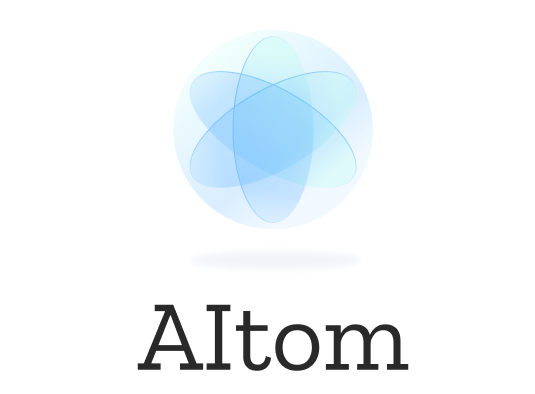
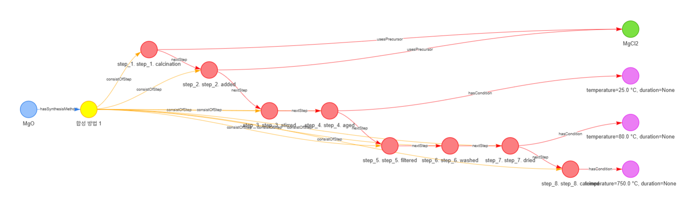
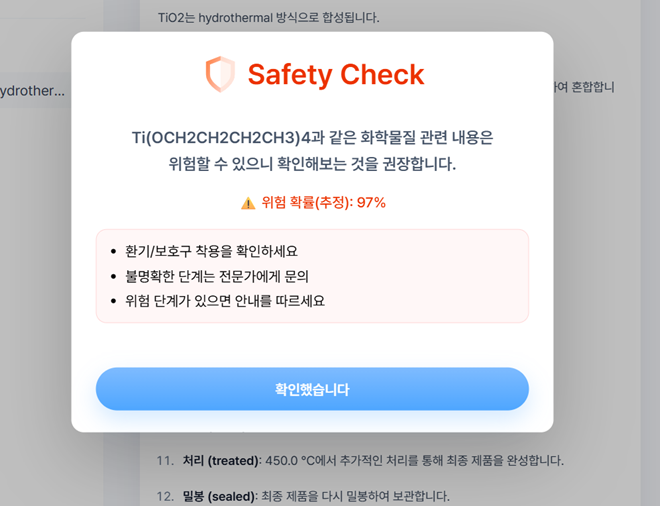

<p align="center">
  <a href="https://github.com/hyun-jin891/AItom/tree/main">
    
  </a>
</p>

<h1 align="center"> Inorganic Material Synthesis Method Chatbot </h1> <br>


# 🔬 Architectural Flow
AItom consists of three core layers:

1. **LLM-Based Structured Extraction**
2. **Ontology-Aligned Knowledge Graph Construction**
3. **Graph Retrieval-Augmented Generation (Graph RAG)**
4. **Transformer-MLP Architecture for Safety Check**

The system enables an end-to-end pipeline:

```
Raw Literature (PMID: 35614129)
↓
Ontology Design
↓
LLM Extraction
↓
Ontology Mapping
↓
Graph Database
↓
Graph Retrieval
↓
LLM Generation (Graph RAG) + Safety Check (Transformer-MLP)
```

# 🔗 Raw Literature
* "Dataset of solution-based inorganic materials synthesis procedures extracted from the scientific literature"
* PMID: 35614129

# 🌐 Ontology Design
* Protege software

```
Node

ChemicalEntity

    InorganicMaterial

    Precursor

    Solvent

    Media

    Abrasive

    Product

    Additive

Process

    SynthesisMethod

    SynthesisStep

ConditionSet

    Condition


Edge

usesPrecursor (SynthesisStep → Precursor)

usesSolvent (SynthesisStep → Solvent)

producesProduct (SynthesisStep → Product)

usesAdditive (SynthesisStep → Addictive)

usesMedia (SynthesisStep → Media)

usesAbrasive (SynthesisStep → Abrasive)

hasSynthesisMethod (InorganicMaterial → SynthesisMethod)

performedUnder (SynthesisStep → Condition)

nextStep (SynthesisStep → SynthesisStep)

       consistOfStep (SynthesisMethod → SynthesisStep)

hasName(ChemicalEntity → xsd:string)

hasAcronym(InorganicMaterial → xsd:string)

hasPhase(InorganicMaterial → xsd:string)

isOxygenDeficiency(InorganicMaterial → xsd:float)

hasReaction(InorganicMaterial → xsd:string)

hasID (SynthesisMethod → xsd:integer)

hasTemperature (Condition → xsd:string)

hasTime (Condition → xsd:string)

haspH (Condition → xsd:string)

hasPressure (Condition → xsd:string)

hasAction(SynthesisStep → xsd:string)

hasNote (SynthesisStep → xsd:string)


```

# 🕸 GraphDB



# 🤖 Safety Check
* Transformer + MLP Architecture
* Transformer: [CrabNet](https://github.com/anthony-wang/CrabNet)

```
pick top12 properties (LightGBM using)
↓
12 checkpoints of CrabNet loading
↓
concat 12 x embedding vector to single embedding vector
↓
MLP Design
↓
Safe / Unsafe Prediction
```




# 👤 Member
| 강지영 (개발)      | 김지원 (개발)     | 장나래 (개발)     | 조현진 (팀장, 개발)  || 김서현 (디자인) |
|:-----------------:|:----------------:|:-----------------:|:--------------------:|:------------:|
| [Jiyoung0219](https://github.com/Jiyoung0219)        |  [gamjawon](https://github.com/gamjawon)  |  [brandnewwwnarae](https://github.com/brandnewwwnarae)    | [hyun-jin891](https://github.com/hyun-jin891)|  |


